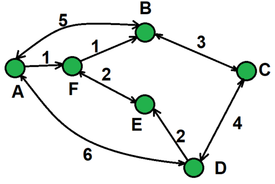

# Сайранов Эльдар ИТ-3 Лабораторная №1

# Задание 1

## Задача 2

### Текст задачи

**Человек.**<br>
Создайте сущность Человек, которая описывается:<br>

- Имя: строка
- Рост: целое число

Может возвращать текстовое представление вида “Name, рост: height”, где Name и height это
переменная с именем и ростом.<br>
Необходимо создать и вывести на экран следующих людей:

- Человек с именем “Клеопатра” и ростом 152
- Человек с именем “Пушкин ” и ростом 167.
- Человек с именем “Владимир ” и ростом 189

### Алгоритм решения

```java
public class Person {
    private final String name;
    private final int height;

    public Person(String name, int height) {
        this.name = name;
        this.height = height;
    }

    public String toString() {
        return name + ", рост: " + height;
    }
}
```

## Задача 3

### Текст задачи

**Имена.**<br>
Создайте сущность Имя, которая описывается тремя параметрами: Фамилия, Личное имя,
Отчество. Имя может быть приведено к строковому виду, включающему традиционное
представление всех трех параметров: Фамилия Имя Отчество (например “Иванов Иван
Иванович”). Необходимо предусмотреть возможность того, что какой-либо из параметров может
быть не задан, и в этом случае он не учитывается при приведении к текстовому виду.<br>
Необходимо создать следующие имена:

- Клеопатра
- Пушкин Александр Сергеевич
- Маяковский Владимир

Обратите внимание, что при выводе на экран, не заданные параметры никак не участвуют в
образовании строки.

### Алгоритм решения

```java
public class Name {
    private final String lastName;
    private final String firstName;
    private final String middleName;

    public Name(String lastName, String firstName, String middleName) {
        this.lastName = lastName;
        this.firstName = firstName;
        this.middleName = middleName;
    }

    public String toString() {
        StringBuilder sb = new StringBuilder();

        if (lastName != null && !lastName.isEmpty()) {
            sb.append(lastName);
        }

        if (firstName != null && !firstName.isEmpty()) {
            if (!sb.isEmpty()) sb.append(" ");
            sb.append(firstName);
        }

        if (middleName != null && !middleName.isEmpty()) {
            if (!sb.isEmpty()) sb.append(" ");
            sb.append(middleName);
        }

        return sb.toString();
    }
}
```

# Задание 2

## Задача 2

### Текст задачи

**Человек с именем.**<br>
Объедините сущности Человек из задачи 1.2 и Имя из задачи 1.3 таким образом, чтобы имя
человека задавалось с использованием сущности 1.3, а не строки.
Необходимо объединить ранее созданные объекты имен и людей, с получением:

- Человека с Именем Клеопатра и ростом 152
- Человека с Именем Пушкин Александр Сергеевичи ростом 167
- Человека с Именем Маяковский Владимир и ростом 189

### Алгоритм решения

```java
public class PersonWithName {
    private final Name fullName;
    private final int height;

    public PersonWithName(Name fullName, int height) {
        this.fullName = fullName;
        this.height = height;
    }

    @Override
    public String toString() {
        return fullName + ", рост: " + height;
    }
}
```

# Задание 3

## Задача 3

### Текст задачи

**Города.**<br>
Создайте сущность Город, которая будет представлять собой точку на карте со следующими
характеристиками:

- Название города
- Набор путей к следующим городам, где путь представляет собой сочетание Города и
  стоимости поездки в него.

Кроме того, Город может возвращать текстовое представление, в виде названия города и списка
связанных с ним городов (в виде пары: “название:стоимость”).<br>
Используя разработанную сущность реализуйте схему, представленную на рисунке.


### Алгоритм решения

```java
import java.util.HashMap;
import java.util.Map;

public class City {

    private final String name;
    private final Map<City, Integer> paths;

    public City(String name) {
        this.name = name;
        this.paths = new HashMap<>();
    }

    public void addPath(City city, int cost) {
        paths.put(city, cost);
    }

    @Override
    public String toString() {
        StringBuilder sb = new StringBuilder();
        sb.append(name).append(" -> ");

        for (Map.Entry<City, Integer> entry : paths.entrySet()) {
            sb.append(entry.getKey().name).append(":").append(entry.getValue()).append(" ");
        }

        return sb.toString();
    }
}
```

# Задание 4

## Задача 8

### Текст задачи

**Создаем Города.**
Измените сущность Город из задачи 3.3. Новые требования включают:

- Город можно создать указав только название
- Город можно создать указав название и набор связанных с ним городов и стоимостей
  путей к ним

### Алгоритм решения

```java
import java.util.HashMap;
import java.util.Map;

public class City {

    private final String name;
    private final Map<City, Integer> paths;

    public City(String name) {
        this.name = name;
        this.paths = new HashMap<>();
    }

    public City(String name, Map<City, Integer> initialPaths) {
        this.name = name;
        this.paths = new HashMap<>(initialPaths);
    }

    public void addPath(City city, int cost) {
        paths.put(city, cost);
    }

    @Override
    public String toString() {
        StringBuilder sb = new StringBuilder();
        sb.append(name).append(" -> ");

        for (Map.Entry<City, Integer> entry : paths.entrySet()) {
            sb.append(entry.getKey().name).append(":").append(entry.getValue()).append(" ");
        }

        return sb.toString();
    }
}
```

# Задание 5

## Задача 5

### Текст задачи

**Дроби.**<br>
Создайте сущность Дробь со следующими особенностями:

- Имеет числитель: целое число
- Имеет знаменатель: целое число
- Дробь может быть создана с указанием числителя и знаменателя
- Может вернуть строковое представление вида “числитель/знаменатель”
- Может выполнять операции сложения, вычитания, умножения и деления с другой Дробью
  или целым числом. Результатом операции должна быть новая Дробь (таким образом,обе
  исходные дроби не изменяются)

Затем необходимо выполнить следующие задачи:

1. Создать несколько экземпляров дробей.
2. Написать по одному примеру использования каждого метода.
3. Вывести на экран примеры и результаты их выполнения в формате «1/3 * 2/3 = 2/9»
4. Посчитать f1.sum(f2).div(f3).minus(5)

### Алгоритм решения

```java
```
